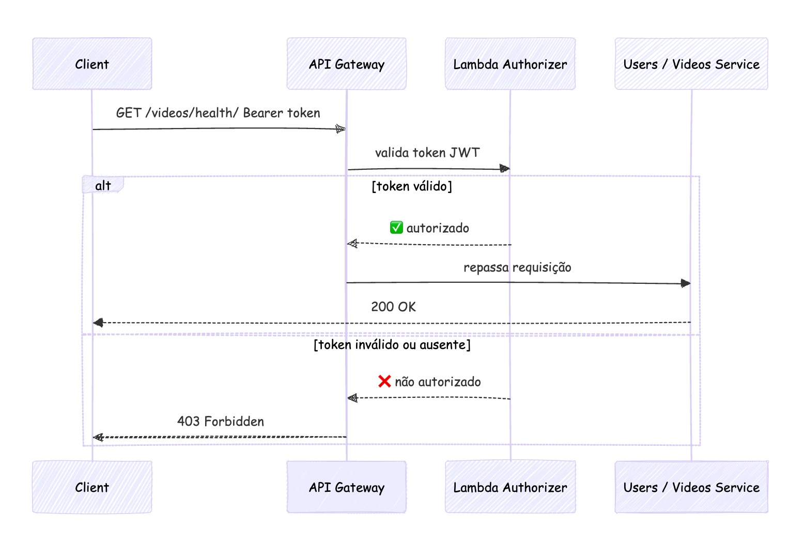

# hack-fiap233-users

Microsserviço de usuários em Go.

## Fluxo de autenticação

O diagrama abaixo é um **diagrama de sequência** que explica o fluxo de autenticação: 
 - o cliente envia a requisição com Bearer token, 
 - o API Gateway delega a validação do JWT ao Lambda Authorizer,
 - em caso de token válido a requisição é repassada ao backend (Users/Videos),
 - em caso inválido ou ausente o Gateway responde 403.



---

## Endpoints

| Método | Rota | Descrição |
|--------|------|-----------|
| GET | `/users/health` | Health check + status do banco |
| POST | `/users/register` | Registrar usuário (`{"name":"...","email":"...","password":"..."}`) |
| POST | `/users/login` | Login (`{"email":"...","password":"..."}`) → retorna JWT |
| GET | `/users/me` | Retorna o usuário autenticado (exige header `X-User-Id`) |
| GET | `/users/` | Lista todos os usuários (exige login: header `X-User-Id`) |

**Rotas protegidas** (`/users/me`, `/users/`): em produção o API Gateway (Lambda Authorizer) valida o JWT e repassa `X-User-Id` e `X-User-Email`. 
O serviço não valida JWT; apenas lê esses headers. 
Sem `X-User-Id` válido a API retorna **401 Unauthorized**.

---

## Verificar em ambiente local (sem AWS)

Para baixar o repositório e rodar o serviço na sua máquina **sem usar a infraestrutura da AWS** (EKS, RDS, etc.):

### 1. Subir o Postgres

Na raiz do repositório `hack-fiap233-users`:

```bash
docker compose -f docker-compose.local.yml up -d
```

Isso sobe um PostgreSQL com o banco `usersdb` na porta **5432**.

### 2. Variáveis de ambiente e rodar o serviço

```bash
export PORT=8080
export JWT_SECRET=qualquer-secret-para-desenvolvimento-local
export DB_HOST=localhost
export DB_PORT=5432
export DB_USERNAME=dbadmin
export DB_PASSWORD=localdev
export DB_NAME=usersdb
export DB_SSLMODE=disable

go run main.go
```

### 3. Executar em ambiente local

```bash
# Health
curl http://localhost:8080/users/health

# Registrar usuário
curl -X POST http://localhost:8080/users/register -H "Content-Type: application/json" \
  -d '{"name":"Teste","email":"teste@teste.com","password":"123456"}'

# Login (obter JWT)
curl -X POST http://localhost:8080/users/login -H "Content-Type: application/json" \
  -d '{"email":"teste@teste.com","password":"123456"}'

# Rotas protegidas (em local use o header X-User-Id; em produção o Gateway injeta após validar JWT)
curl -H "X-User-Id: 1" http://localhost:8080/users/me
curl -H "X-User-Id: 1" http://localhost:8080/users/
```

Para derrubar o Postgres: `docker compose -f docker-compose.local.yml down`.

### Pré-requisitos

- [Go](https://go.dev/dl/) 1.21+
- [Docker](https://docs.docker.com/get-docker/) (para o Postgres local)

---

## Deploy (AWS)

O deploy é automático via GitHub Actions. Qualquer push na `main` executa:

1. Build da imagem Docker
2. Push para o ECR
3. Deploy no cluster EKS

### Secrets necessárias no GitHub

| Secret | Descrição |
|---|---|
| `AWS_ACCESS_KEY_ID` | Access Key da AWS Academy |
| `AWS_SECRET_ACCESS_KEY` | Secret Key da AWS Academy |
| `AWS_SESSION_TOKEN` | Session Token da AWS Academy |
